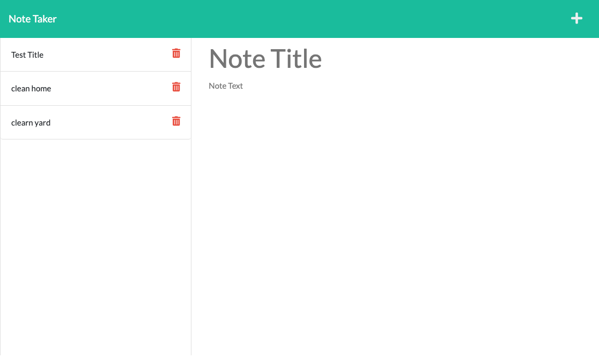

# Note Taker

## Purpose
This program is a online note typing and saving app where you add a new note with the plus button, type the note save the note and then the app shows all your saved notes that you can also delete when its not deeded anymore.

## Built With
* Javascript
* Node.js
* Express.js
* Heroku

## GitHub Repository
https://github.com/Itzamary/NOTE-TAKER

## heroku Link
https://shrouded-tor-50681.herokuapp.com/notes

## Website Image

